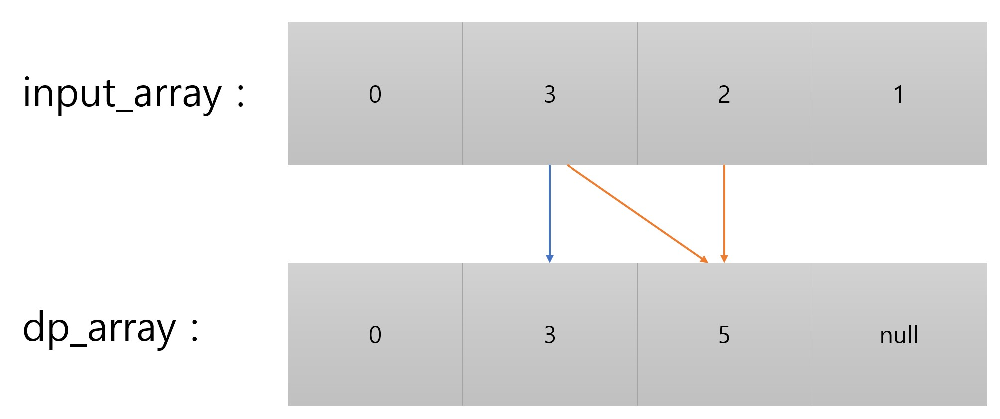
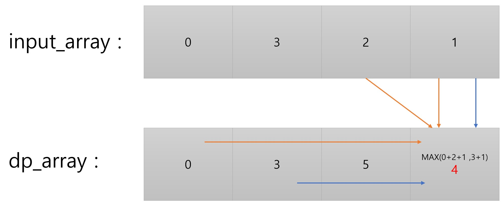

 # [계단 오르기](https://www.acmicpc.net/problem/2579)

## bottom up 방식으로 dp 문제 해결

## 점화식
- 계단은 한 번에 한 계단씩 또는 두 계단씩 오를 수 있다. 즉, 한 계단을 밟으면서 이어서 다음 계단이나, 다음 다음 계단으로 오를 수 있다.
  
- 연속된 세 개의 계단을 모두 밟아서는 안 된다. 단, 시작점은 계단에 포함되지 않는다.
  
- 마지막 도착 계단은 반드시 밟아야 한다.
  

    
    

3번 연속으로 계단을 밟을 수 없으므로 

1. dp_array[index-3]+input_array[index-1]+input_array[index]
2. dp_array[index-2]+input_array[index]

1 번과 2번 중 큰 값을 현재 dp_array[index] 에 삽입한다.
