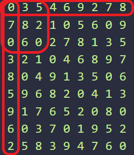

# 스도쿠
[https://www.acmicpc.net/problem/2580](https://www.acmicpc.net/problem/2580)


가로, 세로, 3x3 배열 1~9 까지 체크할 수 있는 2차 배열을 만든다.

1~9까지 체크해야 하기 때문에 배열의 크기를 `0~9` 까지 `10`으로 정한다.




그림처럼 각각 9x9 배열 3개가 만들어 진다..

```js
const rowUsed = [];
const colUsed = [];
const boxUsed = [];
for (let row = 0; row < 9; row++) {
    rowUsed.push(Array(9 + 1).fill(false));
    colUsed.push(Array(9 + 1).fill(false));
    boxUsed.push(Array(9 + 1).fill(false));
}
```

그 뒤에 dfs 로 나올 수 있는 가지 수 만큼 돌려보면 된다.
